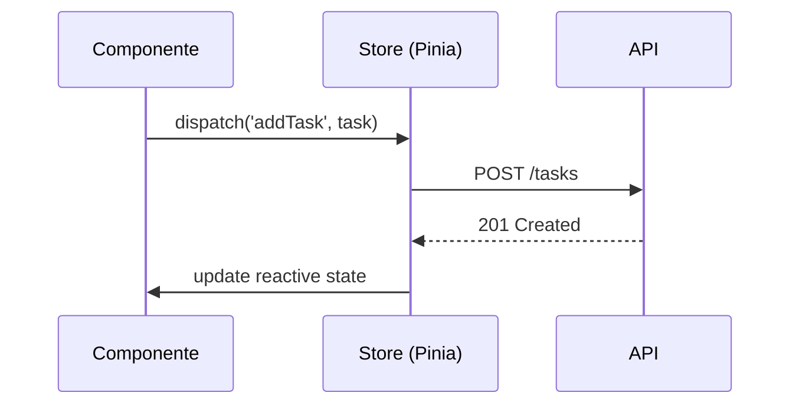

# Dashboard To-Do List - Documentação Completa

  
**🔗 Aplicação Online**: [dashboard-todolist.vercel.app](https://dashboard-todolist.vercel.app)  
**📦 Repositório**: [github.com/daniele-senko/dashboard-todolist](https://github.com/daniele-senko/dashboard-todolist)

## 🚀 Visão Geral
Sistema integrado de gerenciamento de tarefas com dashboard analítico desenvolvido com tecnologias modernas.

## 🛠️ Stack Tecnológico

### Core
| Tecnologia | Versão | Finalidade |
|------------|--------|------------|
| Vue 3 | 3.3.x | Framework principal |
| Pinia | 2.1.x | Gerenciamento de estado |
| Tailwind CSS | 3.3.x | Estilização |
| Vercel | - | Hospedagem e CI/CD |

### Principais Bibliotecas
```javascript
{
  "dependencies": {
    "chart.js": "^4.4.x",      // Visualização de dados
    "vue-router": "^4.2.x",    // Navegação
    "date-fns": "^2.30.x"      // Manipulação de datas
  }
}
```

## 🎯 Funcionalidades

### Sistema de Tarefas
- **CRUD Completo**
  - Adição com validação em tempo real
  - Edição inline
  - Exclusão com confirmação

- **Organização**
  ```mermaid
  graph TD
    A[Tarefas] --> B[Filtros]
    B --> C[Status]
    B --> D[Prioridade]
    B --> E[Data]
  ```

### Dashboard Interativo
| Componente | Tecnologia | Dados |
|------------|------------|-------|
| Gráfico de Barras | Chart.js | Progresso semanal |
| Pizza de Status | Chart.js | Concluídas/Pendentes |
| Cartões Resumo | Tailwind CSS | Métricas chave |

## 🏗️ Arquitetura

### Estrutura de Arquivos
```
```bash
src/
├── assets/
│   └── styles/
│       └── animations.css # Animações customizadas
├── components/
│   ├── Dashboard.vue      # Componente do dashboard
│   └── TodoList.vue       # Componente principal de tarefas
├── stores/
│   ├── dashboardStore.js   # Estado do dashboard
│   └── taskStore.js       # Lógica das tarefas
├── App.vue                # Componente raiz
├── main.js                # Ponto de entrada
└── router.js              # Configuração de rotas
```

### Fluxo de Dados


## 🚀 Como Executar

### Pré-requisitos
- Node.js 18+
- npm 9+

### Passo a Passo
1. Clone o repositório:
   ```bash
   git clone https://github.com/daniele-senko/dashboard-todolist.git
   cd dashboard-todolist
   ```

2. Instale dependências:
   ```bash
   npm install
   ```

3. Ambiente de desenvolvimento:
   ```bash
   npm run dev
   ```
   Acesse: [http://localhost:3000](http://localhost:3000)

4. Testes:
   ```bash
   npm run test:unit   # Testes unitários
   npm run test:e2e    # Testes end-to-end
   ```

## 🌐 Deploy na Vercel

### Configuração
```json
// vercel.json
{
  "version": 2,
  "builds": [
    {
      "src": "vite.config.js",
      "use": "@vercel/static-build",
      "config": {
        "distDir": "dist"
      }
    }
  ],
  "routes": [
    {
      "src": "/(.*)",
      "dest": "/index.html"
    }
  ]
}
```

### Variáveis de Ambiente
| Chave | Valor Exemplo | Obrigatório |
|-------|---------------|-------------|
| VITE_API_URL | https://api.example.com | Não |
| VITE_APP_ENV | production | Sim |

## ⚠️ Desafios Técnicos

### 1. Renderização de Gráficos
**Problema**: Atualização lenta com muitos dados  
**Solução**:
```javascript
// useChartOptimization.js
export function useChartOptimization() {
  const debouncedUpdate = useDebounceFn((chart) => {
    chart.update()
  }, 150)

  return { debouncedUpdate }
}
```

### 2. Estado Persistente
**Problema**: Perda de estado ao atualizar  
**Solução**:
```javascript
// taskStore.js
const storedTasks = JSON.parse(localStorage.getItem('tasks')) || []
state: () => ({ tasks: storedTasks })
```

### 3. Responsividade
**Problema**: Quebras em mobile  
**Solução Tailwind**:
```html
<div class="grid grid-cols-1 md:grid-cols-2 lg:grid-cols-4 gap-4">
  <!-- Cartões se ajustam automaticamente -->
</div>
```

## 🤝 Como Contribuir
1. Faça um fork do projeto
2. Crie sua feature branch:
   ```bash
   git checkout -b feature/nova-feature
   ```
3. Commit seguindo o padrão:
   ```bash
   git commit -m "feat: adiciona filtro por tags"
   ```
4. Push para a branch:
   ```bash
   git push origin feature/nova-feature
   ```
5. Abra um Pull Request

## 📄 Licença
MIT License - Veja o arquivo [LICENSE](LICENSE) para detalhes.
