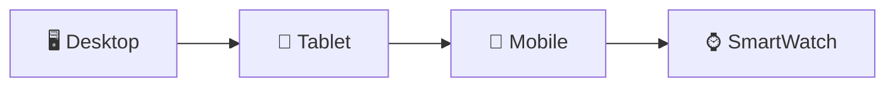

# TaskFlow: Sistema de Gerenciamento de Tarefas com Dashboard Analítico

## 📌 Visão Geral
O TaskFlow é um sistema completo de gerenciamento de tarefas integrado a um dashboard analítico, desenvolvido com Vue.js 3 para oferecer uma experiência intuitiva e visualmente atraente.

## ✨ Funcionalidades

### 📝 Lista de Tarefas
- **CRUD completo** de tarefas
- **Filtros avançados**:
  - ✅ Todas | 📅 Hoje | ⏳ Pendentes | ✔️ Concluídas | 🔴 Atrasadas
- **Ordenação** por data, prioridade ou recência
- **Sistema de prioridades**: 🔵 Baixa | 🟡 Média | 🔴 Alta
- **Persistência automática** no LocalStorage

### 📊 Dashboard Analítico
- **Gráfico de progresso semanal** (linhas)
- **Distribuição de status** (pizza)
- **Métricas-chave** em cards
- **Suporte a temas** 🌞 claro / 🌚 escuro

## 🛠 Stack Tecnológica
| Categoria           | Tecnologias                          |
|---------------------|--------------------------------------|
| Frontend            | Vue.js 3 (Composition API)           |
| State Management    | Pinia                                |
| Data Visualization  | Chart.js + vue-chart-3               |
| UI/Icons            | Tailwind CSS + Heroicons             |
| Data Persistence    | LocalStorage API                     |

## 🚀 Executando o Projeto
```bash
# Clone o repositório
git clone https://github.com/seu-user/taskflow.git

# Instale as dependências
npm install

# Inicie o servidor de desenvolvimento
npm run dev

# Build para produção
npm run build
```


## 🌟 Destaques do Projeto

### 🎨 Experiência do Usuário
- **Micro-interações** para feedback visual
- **Modo claro/escuro** com persistência de preferência
- **Responsividade** total para mobile/desktop
- **Toasts** de confirmação para ações importantes

### ⚡ Performance
- **Carregamento instantâneo** (dados locais)
- **Atualizações em tempo real** no dashboard
- **Ordenação otimizada** (algoritmo eficiente)

### 🛠 Boas Práticas
- **Arquitetura modular** (componentes reutilizáveis)
- **Store centralizada** com Pinia
- **Código documentado** (JSDoc)
- **Hooks personalizados** para lógica reutilizável

## 📸 Preview

### 🖥️ Telas Principais
| Dashboard | Lista de Tarefas |
|-----------|------------------|
|  |  |

### 🌓 Modos de Cor
| Modo Claro | Modo Escuro |
|------------|-------------|
|  |  |

### 📱 Responsividade

